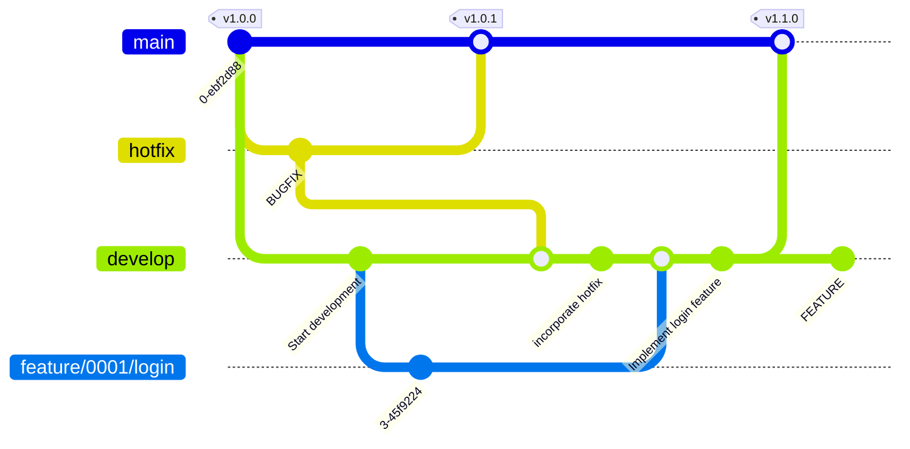

# Branch Strategy

- Adopts a Git Flow based branching strategy
- Uses `develop` as the main integration branch, with additional integration branches for issues based on scale and release operations



## 1. Branch Types

### Basic Syntax

```ini
<branch-type>/<issue-number>/<task-description>
```

For branches like hotfix that may not include an issue number:

```ini
hotfix/<task-description>
```

### Naming Convention

| Branch Type       | Naming Convention                       | Purpose                                          |
| ------------ | --------------------------------------- | ------------------------------------------- |
| **Production**      | `main`                                  | Stable code ready for production deployment. Always kept in a released state              |
| **Development**      | `develop`                               | Integration branch for all features and fixes (main development branch)                       |
| **Feature**     | `feature/<issue-number>/<task>`               | New feature development or improvement tasks. Small issues PR directly to develop         |
| **Enhancement**     | `enhancement/<issue-number>/<task>`           | Enhancement of existing features. UX improvements, performance optimization, etc.                     |
| **Bug Fix**     | `bugfix/<issue-number>/<task>`                | Branch for bug fixes. Integrated into develop after testing                   |
| **Issue Integration**  | `issue/<issue-number>/integration`                       | **Created only for medium to large issues**. Integration branch for consolidating multiple subtasks |
| **Hotfix**     | `hotfix/<issue-number>`                      | Emergency fix for production environment. Reflected in both main and develop after fix        |
| **Test/Validation**   | `test/<issue-number>/<task>`                           | Temporary test code and validation branch. Deleted after verification                  |
| **Documentation** | `docs/<issue-number>/<task>`                           | Branch for documentation updates, guides, README changes, etc.               |
| **Refactoring** | `refactor/<issue-number>/<task>`                       | Branch for improving internal structure without changing behavior                     |
| **Experimental**   | `sandbox/<task>`                        | Experimental branch for trying new ideas or PoC (unofficial). Not intended to merge into stable version  |

### Naming Examples

| Branch Name                             | Purpose                |
| --------------------------------- | ----------------- |
| `feature/0123/add-login`             | New feature               |
| `bugfix/0123/fix-login-error`        | Bug fix                |
| `issue/0123/integration`                         | Integration of multiple subtasks |
| `hotfix/0145/critical-fix`           | Emergency fix              |

## 2. Development Flow

### Step 1. Subtask Development

Create a branch for each required subtask for each issue.

```bash
git switch develop
git switch -c feature/0123/add-login
git switch -c bugfix/0123/fix-login-error
```

- For small issues, create PR directly to develop (move to Step 3)
- For medium to large issues, create an issue integration branch and consolidate subtasks (move to Step 2)

### Step 2. Integration Branch for Medium to Large Issues (Optional)

Create only when consolidating multiple subtasks for review.

```bash
git switch develop
git switch -c issue/0123
git merge feature/0123/add-login
git merge bugfix/0123/fix-login-error
git push -u origin issue/0123
```

- Create integration PR: `issue/0123` → `develop`
- Team performs review and testing together

### Step 3. Integration into develop

- Create PR to `develop` on an issue or subtask basis
- Use `git merge --no-ff` when executing locally

### Step 4. Release

- Fix the version tag in `project.yml` and create PR to `main` branch
- Automatic tagging and release note creation when PR is merged

### Operational Guidelines

| Target | Branch Naming Convention | Purpose/Scope | Operation Policy | Notes |
|------|------------------|----------------|-----------|------|
| **Small Issue** | `feature/<issue-number>-<task>`<br>`bugfix/<issue-number>-<task>` | Small features and fixes | Direct PR to `develop` | Applied to single tasks and minor fixes |
| **Medium to Large Issue** | `issue/<issue-number>` | Consolidate multiple subtasks | PR to `develop` after consolidating subtasks | Review `feature` / `bugfix` together |

## 3. Branch Deletion Policy

| Branch Type                                | Deletion Timing          | Notes               |
| ------------------------------------- | ---------------- | ---------------- |
| `feature` / `bugfix` / `issue`          | After merge to develop     | Delete immediately (use tags for history tracking if needed) |

## 4. Important Rules

### Rule 1: Use lowercase and hyphens

- Branch names must always be lowercase
- Uppercase letters can cause issues on case-sensitive filesystems
- Use hyphens (`-`) to separate words

**📘 Example**

- ✅ Good: `feature/user-login`
- ❌ Avoid: `Feature_UserLogin`, `FeatUserLogin`

### Rule 2: Start branch names with a clear category token

- Each branch name should start with a category token indicating its purpose.
- Example tokens:
  - `feature` (new feature development)
  - `bugfix` (bug fix)
  - `docs` (documentation update)
- Separate the token and description with a forward slash (`/`)

**📘 Example**

- ✅ Example: `bugfix/payment-timeout`
- ❌ Avoid: `payment-timeout` (purpose unclear)

**Use Cases**

```bash
# Listing branches by token
$ git branch --list "feature/*"

# Pushing or mapping branches with tokens
$ git push origin 'refs/heads/feature/*'

# Deleting multiple branches by token
$ git branch -D $(git branch --list "feature/*")
```

### Rule 3: Keep branch names concise and clear

- Avoid excessively long names while maintaining clarity
- Long branch names don't fit on a single line in logs, reducing visibility

**📘 Example**

- ✅ Good: `refactor/api-headers`
- ❌ Bad: `refactor/update-the-way-we-handle-request-headers-in-api`

### Rule 4: Avoid creating branches that can cause conflicts

- Avoid ambiguous names like `git switch -c feature` or names that could conflict with existing branches
- Git internally manages branch names as paths, so if `feature` is created, `feature/login-v2` will fail with a name collision
  - Cannot create both a file and directory at the same level

**📘 Example**

```bash
$ git switch -c bugfix/0123/fix-login-error
Switched to a new branch 'bugfix/0123/fix-login-error'

$ ls .git/refs/heads/bugfix/0123
fix-login-error
```
